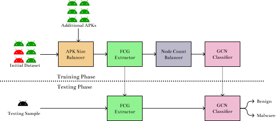

# AndMal-Detect

Android Malware Detection using Function Call Graphs and Graph Convolutional Networks

# What?

A research work carried out by me ([Vinayaka K V](https://github.com/vinayakakv)) during MTech (Research) degree in Department of IT, NITK.

The objectives of the research were:

1. To evaluate whether GCNs were effective in detecting Android Malware using FCGs, and which GCN algorithm is best for this task.
2. To enhance the FCGs by incorporating the callback information obtained from the framework code, and evaluate them against the normal FCGs

# Code organization

The code achieving first objective is present at `master` (current) branch, while the code achiving second objective is present at `experiment` branch.

# Methodology

## Datasets

Stored in the [`/data`](/data) folder. Currently, it contains SHA256 of the APKs containing in training and testing splits.

## APK Size Balancer

Obtains the histogram of APK sizes, adds APKs wherever there is a huge imbalance between the number of APKs between classes.

> **Note:** *The provided dataset is already APK Size balanced* 🥳

## FCG Extractor

Implemented in [`scripts/process_dataset.py`](scripts/process_dataset.py).

The class `FeatureExtractors` provides two public methods:

1. `get_user_features()` - Returns 15-bit feature vector for *internal* methods
2. `get_api_features()` - Returns a one-hot feature vector for *external* methods

The method `process` extracts the FCG and assignes node features.

## Node Count Balancer

Balances the dataset so that the node count distribution of the APKs between the classes is exactly the same.

Implemmented in [`scripts/split_dataset.py`](scripts/split_dataset.py).

> **Note:** *The provided dataset is already node-count balanced to ensure **reproducibility*** 🤩

## GCN Classifier

Multi-layer GCN with dense layer at the end.

Implemented in [`core/model.py`](core/model.py)

# The Execution Pipeline

1. Obtain the APKs ug
2.  given SHA256 from [AndroZoo](https://androzoo.uni.lu/)
3. Build the container (either singularity or docker), and get into its shell
4. Run `scripts/process_dataset.py`[scripts/process_dataset.py] on the downloaded dataset

        python process_dataset.py \
            --source-dir <source_directory> \
            --dest-dir <dest_directory> \
            --override # If you want to oveeride existing processed files \
            --dry # If you want to perform a dry run

4. Train the model! For configuration, refer to the section below.

    python train_model.py

# Configuration

The configuration is achieved using [Hydra](https://hydra.cc/). Look into [`config/conf.yaml`](config/conf.yaml) for available configuration options.

Any configuration option can be overridden in the command line. As an example, to change the number of convolution layers to 2, invoke the program as

    python train_model.py model.convolution_count=2

You can also perform a sweep, for example,

        python train_model.py \
            model.convolution_count=0,1,2,3 \
            model.convolution_algorithm=GraphConv, SAGEConv, TAGConv, SGConv, DotGatConv \
            features=degree, method_attributes, method_summary

to train the model in all possible configurations! 🥳

# Stack

- [`androguard`](https://androguard.readthedocs.io/en/lates) - For FCG extraction and Feature assignment
- [`pytorch`](https://pytorch.org/) - for Neural networks
- [`dgl`](https://www.dgl.ai/) - for GCN modules
- [`pytorch-lightning`](https://github.com/PyTorchLightning/pytorch-lightning) - for organization and pipeline 💖
- [`hydra`](https://hydra.cc/) - for configuring experiments
- [`wandb`](https://wandb.ai/) - for tracking experiments 🔥

# Cite as

The research paper corresponding to this work is available at [IEEE Xplore](https://ieeexplore.ieee.org/document/9478141). If you find this work helpful and use it, please cite it as

        @INPROCEEDINGS{9478141,
                author={V, Vinayaka K and D, Jaidhar C},
                booktitle={2021 2nd International Conference on Secure Cyber Computing and Communications (ICSCCC)},
                title={Android Malware Detection using Function Call Graph with Graph Convolutional Networks},
                year={2021},
                volume={},
                number={},
                pages={279-287},
                doi={10.1109/ICSCCC51823.2021.9478141}
        }
